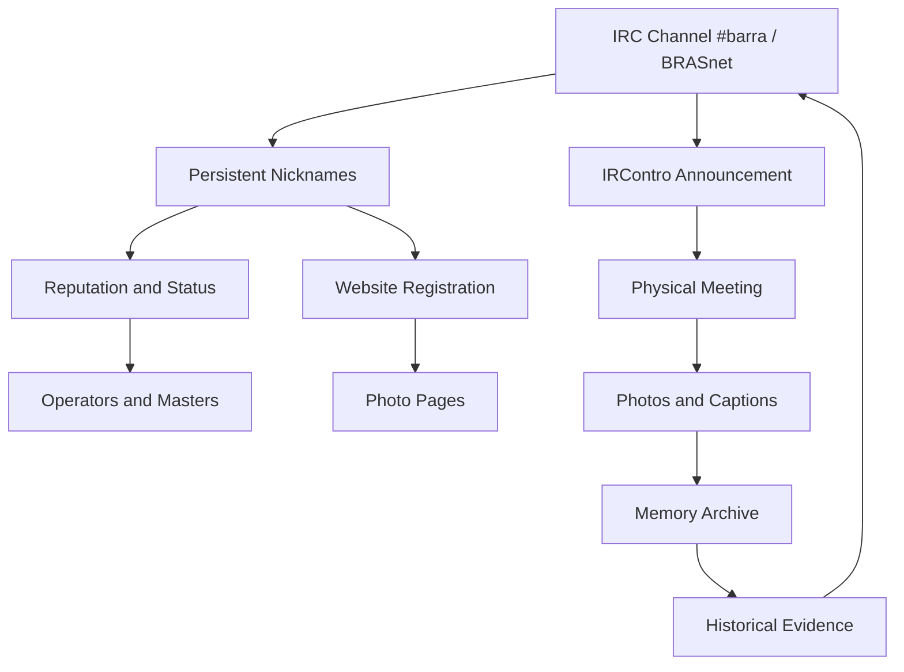

# IRContro Graph Bridge

## Purpose

This document explains why IRContros are central to the Canal Barra historical thesis.

An **IRContro** was not only a meetup. It was the physical continuation of an online social graph created inside IRC/BRASnet and reinforced by the Canal Barra website.

## Core Argument

Canal Barra connected:

```text
IRC channel
→ persistent nickname identity
→ reputation and status
→ operators and masters
→ website registration
→ event announcement
→ physical meetup
→ photo page and captions
→ collective memory
→ return to the channel
```

That loop is one of the strongest reasons to classify Canal Barra as a proto-social-network system, not merely as a chat channel.

## Mermaid Diagram



## Why This Matters

The IRContro evidence proves that Canal Barra produced a hybrid social layer:

- online identity;
- offline recognition;
- recurring participation;
- public memory;
- reputation continuity;
- social return to the channel.

This is different from a temporary chat conversation.

The channel created identities that crossed the screen and returned with more social weight.

## Evidence Types

IRContro records may be supported by:

- Wayback captures;
- event pages;
- photo captions;
- homepage announcements;
- operator notes;
- founder statements;
- participant testimony;
- metadata extracted from old site structures.

## Privacy Rule

The repository should prefer nickname-level and event-level metadata.

Do not publish identifiable photos, civil names or private details without permission or a clear archival/legal basis.

## Core Sentence

**IRContros are the bridge evidence: they show that Canal Barra transformed synchronous IRC interaction into real-world social presence, then archived that presence back into the web.**
