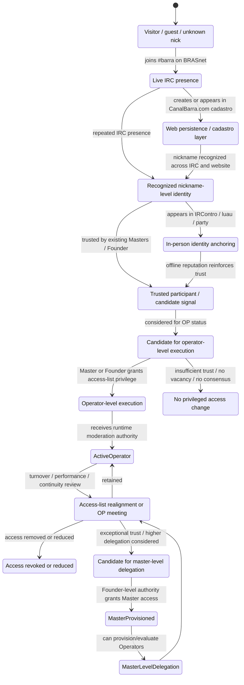

# Access Governance State Machine

This document models Canal Barra access provisioning as a historical state machine.

It does not claim that every transition was automated or formally documented from the beginning. It provides a technical model for how a participant could move from ordinary presence to trusted operational authority across the Canal Barra stack.

## State machine

## Interpretation

The model separates four layers:

1. Live IRC presence.
2. Web-backed persistence through CanalBarra.com.
3. In-person identity and reputation anchoring through IRContros and gatherings.
4. Tiered access governance through Founder, Masters, Operators and access-list realignment.

## Default synchronization assumption

Unless evidence documents a specific bot or automated bridge, the connection between these layers should be treated as human-mediated state synchronization.

That means reputation and eligibility signals were recognized by people across IRC presence, web cadastro records and in-person gatherings, while technical access-list changes were executed through the available IRC service mechanisms.

## Key transitions

| Transition | Meaning |
| --- | --- |
| `UnknownVisitor -> LiveIrcParticipant` | A user appears in the live IRC channel. |
| `LiveIrcParticipant -> WebRegisteredParticipant` | The nickname becomes associated with web persistence / cadastro evidence. |
| `RecognizedRegular -> InPersonRecognized` | Nickname identity is anchored through an in-person event. |
| `TrustedParticipant -> OperatorCandidate` | Social trust becomes a candidate signal for privileged access. |
| `OperatorCandidate -> OperatorProvisioned` | Master or Founder grants operator-level access. |
| `ActiveOperator -> AccessListReview` | Operational status becomes subject to turnover or realignment. |
| `MasterDelegationCandidate -> MasterProvisioned` | Founder-level authority grants Master access. |

## Evidence boundary

This diagram is a technical abstraction. Individual historical records must still carry their own evidence status, date, source and privacy tier.
